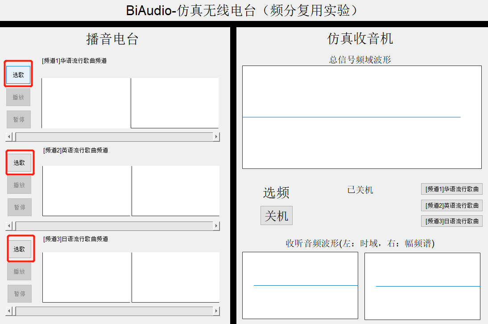
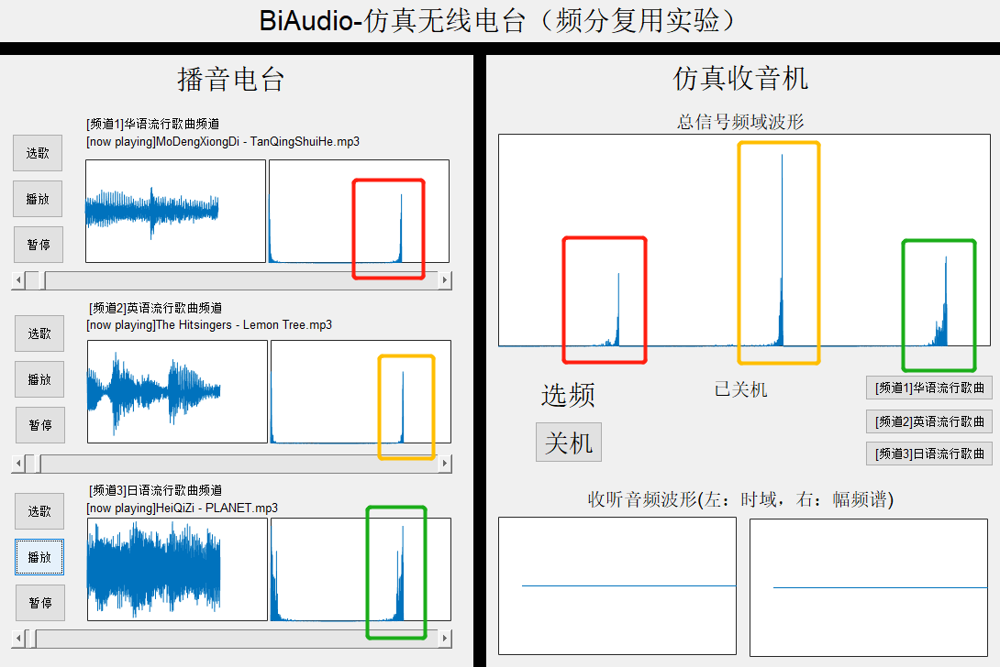
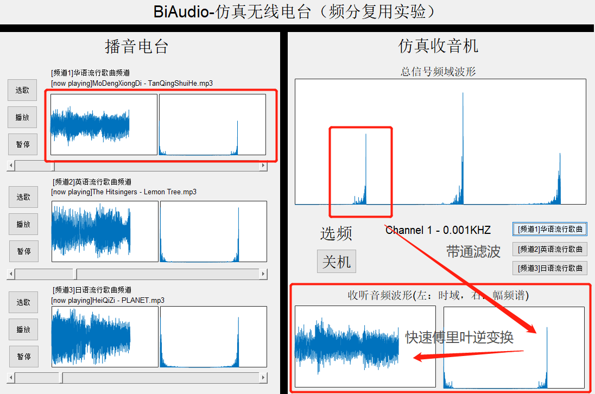
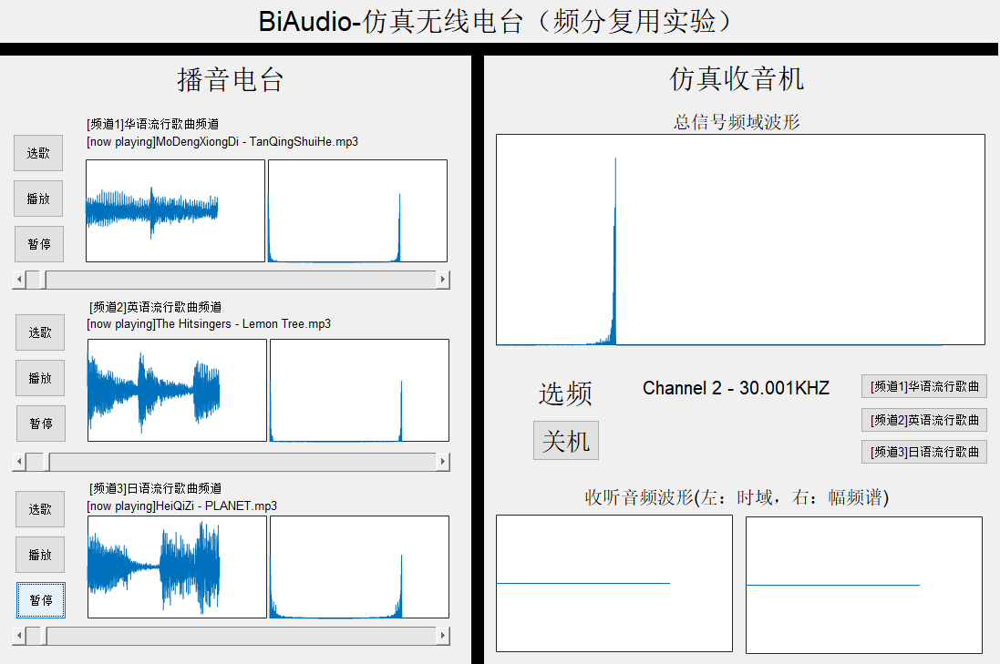

# BiAudio
> Matlab 信号与系统课设 - BiRadio仿真电台
>
> Author : Benjamin142857
>
> Date : 2018-12
>
> [TOC]

## 1. 使用介绍

* 【1】三个播音电台选择好音频文件，若未选择则播放与暂停按钮无法按下，以防程序报错。同时使用了异常处理，当用户打开文件选择目录，未选择文件直接退出时，不影响程序运作，保证了交互的严谨性。

  

* 【2】当三个音频文件都顺利加载完成时，播放与暂停按键恢复可用，此时可开始播放，线程4会对三个电台的音频分段时序性地进行调制，将其单边频谱复用在一个频带上，即总信号。

* 【3】打开收音机频道1，线程5会对总信号进行相应频段的带通滤波，获取到对应电台1音频信号的单边频谱，然后进行快速傅里叶逆变换，再时序性播放出来，我们可看出接收并还原出的波形和电台1播放的原波形有较高的相似度。

  

* 【4】各个电台可独立暂停播放，或者调节进度条，更换播放内容，现在电台2与电台3暂停了播放，在总信号中对应频段的信息也随之小时，从收音机收听的频道2波形看出，此时并未接收到任何内容，因为电台2已暂停播放

  

## 2. 演示视频

> [BiliBili](https://www.bilibili.com/video/av51750964)

